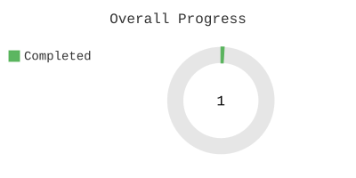
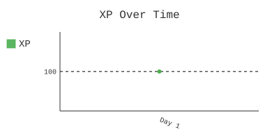
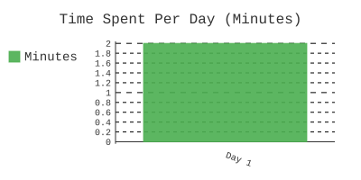
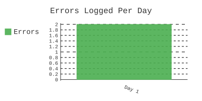

# 100 Days of Python: Advanced Gamified Journey

Welcome to my 100-day Python learning challenge, powered by an advanced tracking and visualization system.

---

## My Dashboard

| Progress | XP Over Time |
| :---: | :---: |
|  |  |

| Time Spent (Minutes) | Errors Logged |
| :---: | :---: |
|  |  |

### Contribution Heatmap


---

## Daily Workflow

This repository is highly automated. Follow this workflow carefully each day.

### 1. Start the Clock
When you are ready to begin working, run this command to log your start time:
```bash
python3 scripts/start_day.py <day_number>
# Example for day 1:
python3 scripts/start_day.py 1
```

### 2. Code & Log
Write your Python code in the `day-XXX/practice.py` file. To execute it and automatically log all output and errors, use this command. You can run this as many times as you need.
```bash
python3 scripts/run_practice.py <day_number>
# Example for day 1:
python3 scripts/run_practice.py 1
```

### 3. Document Your Learnings
Open the `README.md` file for the day and fill out the "Today's Goal" and "What I Learned" sections.

### 4. Complete the Day
When you have finished all work for the day, run this final command. It will log your end time, update all charts, and save everything to GitHub.
```bash
python3 scripts/complete_day.py <day_number> "[Your commit message]"
# Example for day 1:
python3 scripts/complete_day.py 1 "feat: Complete Day 1 with a new script"
```

---

*This advanced gamified repository structure was built by Jules.*
